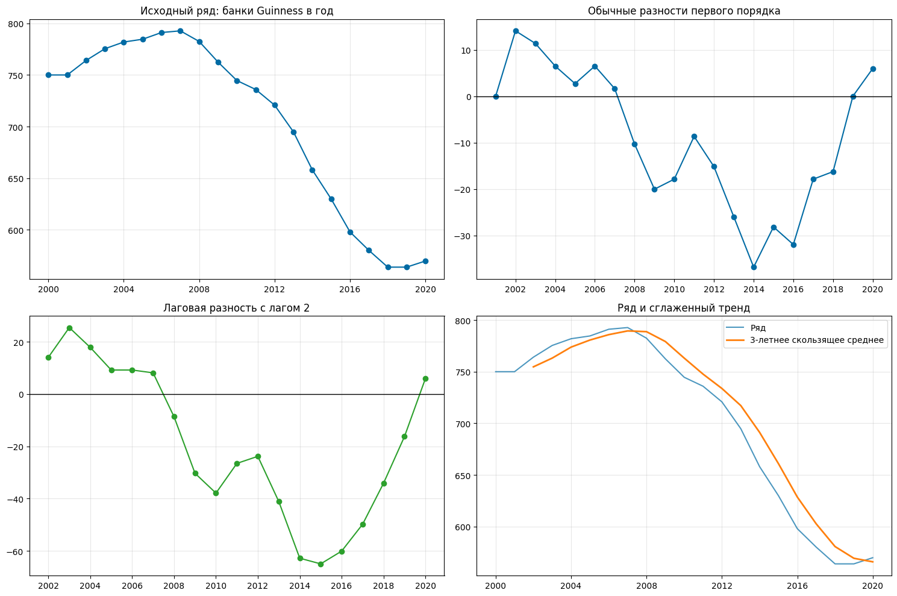
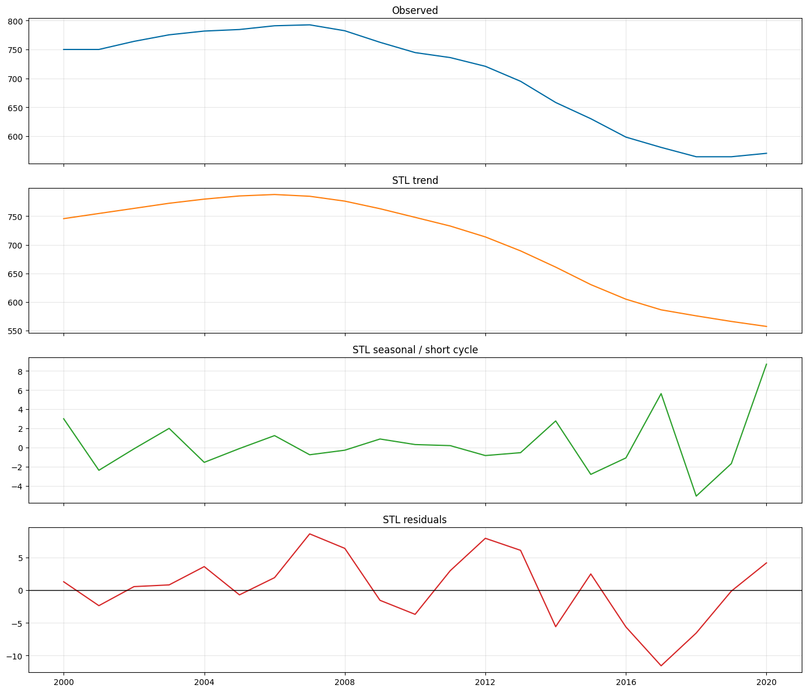
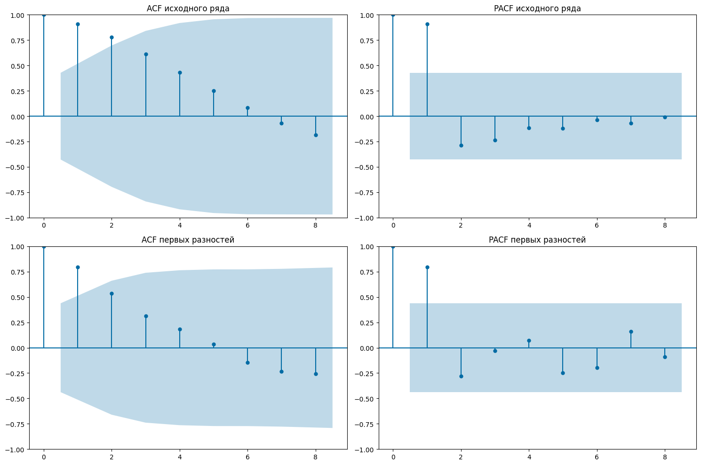
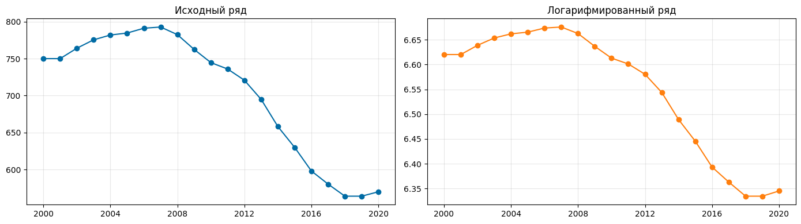
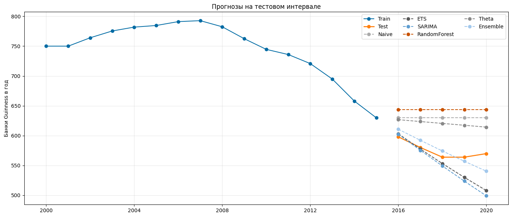
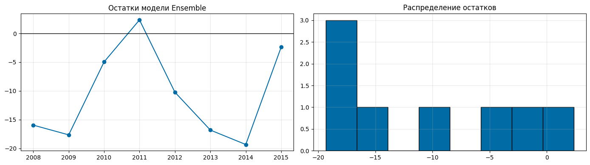
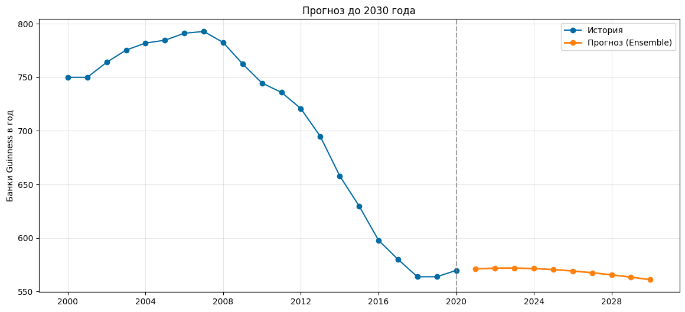
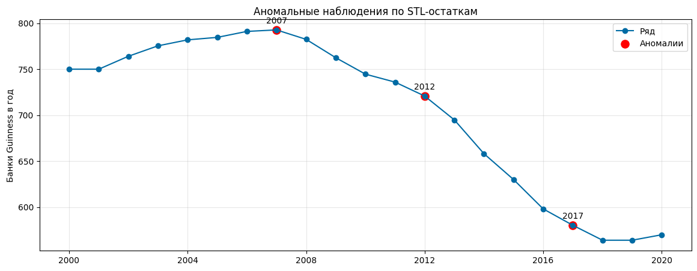

# Alcohol Addiction Forecasting

Итоговый аналитический отчёт по прогнозированию потребления алкоголя в России в пересчёте на банки Guinness. Ниже размещена GitHub-версия отчёта без кода, но со всеми графиками и итоговыми таблицами.

Материалы репозитория:

- [Ноутбук с расчётами](guiness_stats.ipynb)
- [PDF-версия отчёта](guiness_stats.pdf)
- [Датасет WDI](WB_WDI_SH_ALC_PCAP_LI.csv)

---

## Итоговый отчёт

### Прогноз потребления алкоголя в пересчёте на банки Guinness

В работе используется годовой ряд России из World Bank WDI: `WB_WDI_SH_ALC_PCAP_LI.csv`.
Исходная единица измерения — литры чистого алкоголя на человека 15+ в год.
Для интерпретации ряд переводится в **банки Guinness 440 мл, 4.2% ABV**.

Формально в задании упомянут ежемесячный ряд, но здесь осознанно используется годовая частота:
пользователь явно разрешил не привязываться к месячной грануляции. Из-за этого настоящей внутригодовой
сезонности нет, а «сезонные» шаги ниже интерпретируются как квази-сезонные лаговые разности.

Обозначим через $L_t$ потребление чистого алкоголя в литрах на человека в году $t$, а через $Y_t$ —
тот же показатель в банках Guinness. Тогда аналитическая задача состоит в построении прогноза
$\hat{Y}_{2030}$ и его интерпретации в прикладных терминах.

## 2. Подготовка ряда

Одна банка Guinness содержит `440 * 0.042 = 18.48 мл` чистого алкоголя.
Значит, годовое потребление в литрах переводится в количество банок через деление на `0.01848`.

Формально:

$$
a_{can} = 440 \cdot 0.042 = 18.48 \text{ мл этанола},
$$

$$
Y_t = \frac{1000 \cdot L_t}{a_{can}}.
$$

Если нужен пересчёт в граммы чистого этанола, используем плотность $\rho = 0.789$ г/мл:

$$
g_{can} = a_{can} \cdot \rho.
$$

Наблюдений: 21
Период: 2000–2020
Среднее потребление: 704.49 банок Guinness в год на человека 15+
Горизонт итогового прогноза: до 2030 года (10 шагов)

## 3. Визуализация ряда, разностей и компонент

Для годового ряда обычная разность естественна, а лаговая разность с лагом 2 используется как
квази-сезонная: не как календарная сезонность, а как способ проверить наличие двухлетней цикличности.
STL-разложение ниже тоже нужно трактовать аккуратно: тренд и остаток интерпретируются надёжно,
а «seasonal» компонент здесь отражает короткие колебания, а не месячный сезонный паттерн.

Используются преобразования:

$$
\Delta Y_t = Y_t - Y_{t-1},
$$

$$
\Delta_{(2)} Y_t = Y_t - Y_{t-2},
$$

а также STL-разложение

$$
Y_t = T_t + S_t + R_t,
$$

где $T_t$ — тренд, $S_t$ — короткая циклическая компонента, $R_t$ — остаток.

**Комментарий к графикам.**

1. Исходный ряд имеет выраженный восходящий участок до 2007 года и затем устойчивое снижение, то есть средний уровень во времени меняется.
2. После первой разности тренд в значительной степени исчезает, а колебания становятся ближе к стационарным.
3. Лаговая разность с лагом 2 не показывает устойчивой циклической структуры: это дополнительная проверка, а не настоящая сезонность.
4. STL подтверждает, что основную динамику формирует тренд, а короткие колебания и остаток заметно слабее трендовой компоненты.

## 4. ACF и PACF

Для ряда $Y_t$ оцениваются выборочная автокорреляционная функция

$$
\rho(k) = \text{Corr}(Y_t, Y_{t-k}),
$$

и частная автокорреляционная функция, которая показывает связь между $Y_t$ и $Y_{t-k}$
после исключения влияния промежуточных лагов. Эти графики помогают выбрать порядок ARIMA-модели.

**Комментарий к ACF/PACF.**

1. У исходного ряда автокорреляции затухают медленно, что типично для нестационарного ряда с трендом.
2. После обычного дифференцирования автокорреляционная структура становится короче, что поддерживает идею перехода к стационарности.
3. PACF первых разностей допускает компактную ARIMA-спецификацию невысокого порядка; это будет использовано при подборе SARIMA.

## 5. Проверка стационарности

Проверка проводится двумя комплементарными тестами:

1. `ADF`: $H_0$ — ряд имеет единичный корень и нестационарен.
2. `KPSS`: $H_0$ — ряд стационарен относительно константы.

Совместное использование удобно на коротких выборках, где один тест может быть недостаточно мощным.

ADF: нулевая гипотеза — единичный корень.

KPSS: нулевая гипотеза — стационарность.

**Вывод по стационарности.**

Исходный ряд нестационарен: ADF не отвергает единичный корень, а KPSS отвергает стационарность.
Для первых разностей ADF на короткой выборке остаётся слабым, но KPSS уже не отвергает стационарность.
Поэтому в практическом моделировании разумно считать ряд интегрированным порядка 1 и работать с разностями / ARIMA-подходом.

## 6. Преобразование ряда

Применим логарифмирование. Причины:

1. ряд строго положителен;
2. логарифм удобен для интерпретации относительных изменений;
3. модели на лог-шкале дают положительные прогнозы после обратного преобразования.

Преобразование имеет вид

$$
Z_t = \log Y_t.
$$

После построения прогноза на лог-шкале выполняется обратный переход:

$$
\hat{Y}_t = e^{\hat{Z}_t}.
$$

## 7. Деление на train/test

Ряд делится по времени без перемешивания:

$$
\{Y_1, \dots, Y_T\} = \underbrace{\{Y_1, \dots, Y_{T-h}\}}_{train} \cup
\underbrace{\{Y_{T-h+1}, \dots, Y_T\}}_{test},
$$

где $h=5$ — длина тестового горизонта.

Train: 2000 – 2015 (16 наблюдений)
Test : 2016 – 2020 (5 наблюдений)

## 8. Оценка моделей на обучающей выборке

Рассматриваются:

1. `Naive`;
2. `ETS`;
3. `SARIMA`;
4. `Random Forest` по лаговым признакам;
5. `Theta`;
6. усреднение трёх лидеров.

Краткие формулы моделей:

1. `Naive`: `Y_hat(t+1|t) = Y_t`.

2. `ETS` с трендом: `Y_hat(t+h|t) = l_t + h * b_t`, где `l_t` — уровень, а `b_t` — тренд.

3. `SARIMA` в нашем случае вырождается в несезонную ARIMA-структуру для лог-ряда: `phi(B) * (1 - B)^d * Z_t = c + theta(B) * epsilon_t`.

4. `Random Forest` использует лаговые признаки: `X_t = (Z_(t-1), Z_(t-2), Z_(t-3))`.

5. `Theta` раскладывает ряд на theta-линии и комбинирует их прогнозы.

6. Ансамбль лидеров: прогноз получается как среднее арифметическое `m` лучших моделей.

Критерии качества:

$$
MAE = \frac{1}{n}\sum_{t=1}^{n} |Y_t - \hat{Y}_t|,
$$

$$
RMSE = \sqrt{\frac{1}{n}\sum_{t=1}^{n}(Y_t - \hat{Y}_t)^2},
$$

$$
MAPE = \frac{100}{n}\sum_{t=1}^{n}\left|\frac{Y_t-\hat{Y}_t}{Y_t}\right|,
$$

где итог интерпретируется в процентах.

Лучший порядок SARIMA по AIC на train: (1, 1, 0)

**Комментарий к сравнению моделей.**

1. `SARIMA` лучше всех описывает инерцию и перелом тренда на коротком горизонте.
2. `ETS` даёт разумный, но более сглаженный прогноз.
3. `Random Forest` на столь коротком ряде проигрывает классическим временным моделям: данных мало, лаговые признаки бедные.
4. Усреднение трёх лидеров снижает риск ошибки одной конкретной спецификации; по метрикам именно ансамбль часто оказывается самым устойчивым.

## 9. Лучшая модель, остатки и прогноз до 2030 года

Для лучшей модели анализируются остатки

$$
e_t = Y_t - \hat{Y}_{t|t-1}.
$$

Итоговый прогноз строится на всей доступной выборке до целевого горизонта:

$$
\hat{Y}_{2021}, \hat{Y}_{2022}, \dots, \hat{Y}_{2030}.
$$

Лучшая модель на тесте: Ensemble
Лидеры для ансамбля: ['ETS', 'SARIMA', 'Theta']

Средний остаток: -10.618933692507113
Стандартное отклонение остатков: 8.111102629364902

**Комментарий по остаткам.**

Если лучшая модель выбрана адекватно, остатки должны колебаться вокруг нуля без явного тренда.
На короткой годовой выборке идеального white noise ожидать не стоит, но отсутствие систематического смещения
и крупных серий односторонних ошибок означает, что модель улавливает основную динамику приемлемо.

## 10. Сопьёмся ли к 2030 году?

Для ориентировочной оценки возьмём **консервативную минимальную** оценку острой потенциально смертельной
пероральной дозы этанола для взрослого без выраженной толерантности: **5–6 г/кг массы тела**.
Для человека массой 73 кг это соответствует диапазону **365–438 г чистого этанола**, то есть примерно
**25–30 банкам Guinness**, если выпить их за короткое время.

Источник для диапазона 5–6 г/кг: EBM Consult, *Lab Test: Ethanol (Ethyl Alcohol) Level*.
Для сопоставления с клинической тяжестью полезен и Merck Manual: BAC ≥ 400 mg/dL может быть фатальным.

Это сравнение нужно трактовать аккуратно: прогноз в работе годовой, а смертельная доза — острая разовая.
Поэтому ниже сравнивается не только годовой объём, но и среднесуточное потребление в прогнозе на 2030 год.

Формулы:

$$
D_{low} = 73 \cdot 5, \qquad D_{high} = 73 \cdot 6,
$$

где $D_{low}$ и $D_{high}$ — нижняя и верхняя оценки потенциально смертельной острой дозы в граммах этанола.

Прогнозное среднесуточное потребление:

$$
G_{2030}^{day} = \frac{\hat{Y}_{2030} \cdot g_{can}}{365}.
$$

Доля от нижней границы острой смертельной дозы:

$$
q = \frac{G_{2030}^{day}}{D_{low}}.
$$

Если $q < 1$, то среднесуточное прогнозное потребление существенно ниже острой смертельной дозы.

Нет: при равномерном распределении по году прогнозное среднесуточное потребление далеко от консервативной острой смертельной дозы.

**Интерпретация.**

Даже если в годовом объёме 2030 года содержится много «разовых смертельных доз» в сумме, это не означает
немедленную гибель: критична именно концентрация и скорость потребления. По прогнозу среднее потребление в день
остаётся на уровне существенно ниже консервативной острой смертельной дозы. Значит, ответ в терминах этого
грубого сравнения: **к 2030 году “сопьёмся” не в смысле острой разовой смертельной дозы**.

## 11. Дополнительная идея: аномальные годы по STL-остаткам

В качестве дополнительного блока отметим годы, в которых фактическое значение сильно отклонялось
от локальной STL-структуры. Это полезно как проверка на шоки и структурные изменения.

Для отбора используется стандартизованный STL-остаток:

$$
z_t = \frac{R_t - \bar{R}}{s_R}.
$$

Наблюдение считаем аномальным, если $|z_t| \ge 1.5$.

**Итог.**

1. Ряд в исходном виде нестационарен; первая разность заметно улучшает ситуацию.
2. Лог-преобразование уместно и делает модели устойчивее.
3. На коротком годовом ряде лидируют классические временные модели, а лучшая итоговая спецификация определяется по тестовым метрикам.
4. Дополнительный анализ аномалий помогает содержательно интерпретировать годы, когда динамика выбивалась из локального тренда.

В терминах итогового прогноза ключевым числом является прогноз `Y_hat_2030`, а прикладной вывод по риску задаётся сравнением `G_day_2030` с диапазоном `D_low`–`D_high`.
